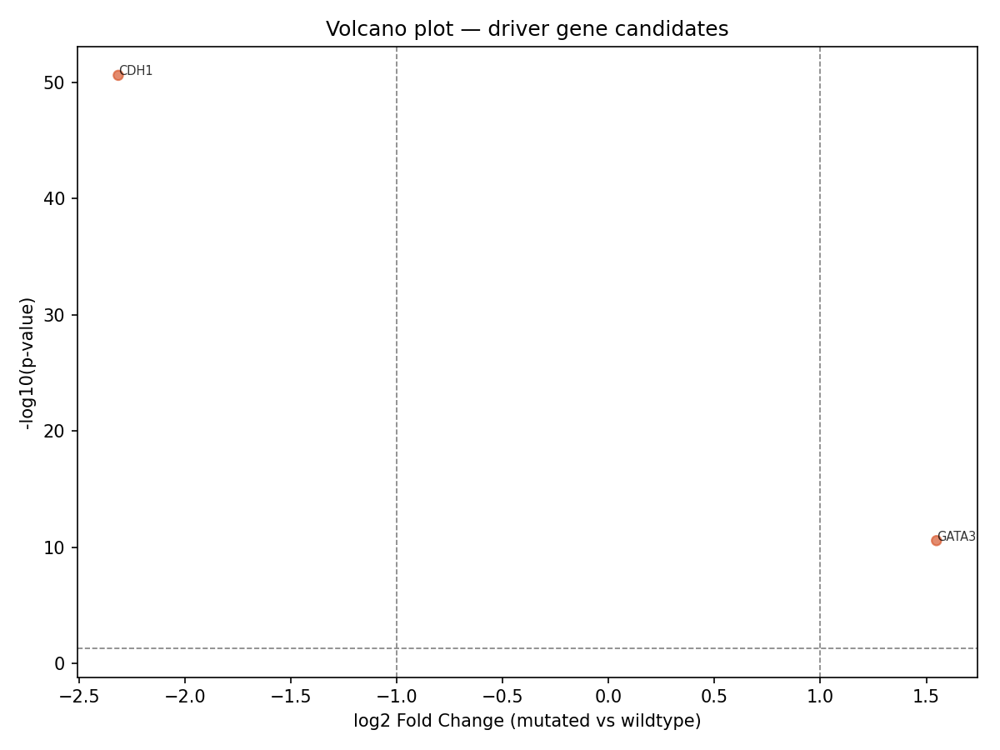
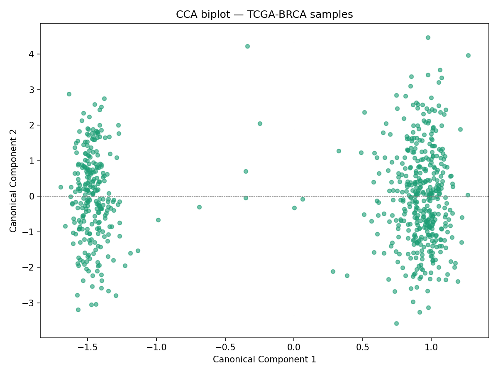

# Multi-Omic Data Integration — TCGA-BRCA Driver Gene Discovery

## Overview

A full multi-omic integration pipeline identifying driver genes in breast cancer
(TCGA-BRCA) by combining RNA-seq expression, DNA mutation, and DNA methylation data.

## Key Findings

- Identified **CDH1** and **GATA3** as high-confidence driver genes
- CDH1: log2FC = -2.31, p = 2.5e-51 (tumor suppressor, hallmark of lobular BRCA)
- GATA3: log2FC = +1.55, p = 2.6e-11 (luminal subtype transcription factor)

## Pipeline

| Stage             | Tool                         | Description                          |
| ----------------- | ---------------------------- | ------------------------------------ |
| Data download     | R / TCGAbiolinks             | GDC API, 675 matched samples         |
| Preprocessing     | R / SummarizedExperiment     | Filtering, imputation                |
| Normalization     | R / DESeq2, sva              | VST, ComBat batch correction         |
| Feature selection | Python / pandas, numpy       | MAD, variance, recurrence filters    |
| Integration       | Python / scikit-learn        | Canonical Correlation Analysis (CCA) |
| Visualization     | Python / matplotlib, seaborn | Volcano, heatmap, biplot             |

## Data

- RNA-seq: 19,522 genes × 1,231 samples
- DNA mutation: 15,359 genes × 990 samples
- DNA methylation: 402,482 probes × 895 samples
- Common samples after intersection: 675

## Requirements

### R

- TCGAbiolinks, DESeq2, sva, SummarizedExperiment, maftools, sesame

### Python

- pandas, numpy, scipy, scikit-learn, matplotlib, seaborn

## Usage

```bash
# R scripts (in order)
Rscript R/01_download.R
Rscript R/02_preprocess.R
Rscript R/03_normalize.R

# Python scripts (in order)
python python/04_feature_selection.py
python python/05_cca_integration.py
python python/06_visualization.py
```

## Results




```

---

**For your resume**, add it under a Projects section like this:
```

Multi-Omic Cancer Genomics Pipeline 2026

- Built end-to-end pipeline integrating RNA-seq, DNA mutation, and
  methylation data from 675 TCGA breast cancer samples
- Applied Canonical Correlation Analysis (CCA) to identify CDH1 and
  GATA3 as driver genes (p < 1e-10)
- Tools: R (TCGAbiolinks, DESeq2, sva), Python (scikit-learn, pandas)
- Full pipeline and results available on GitHub
